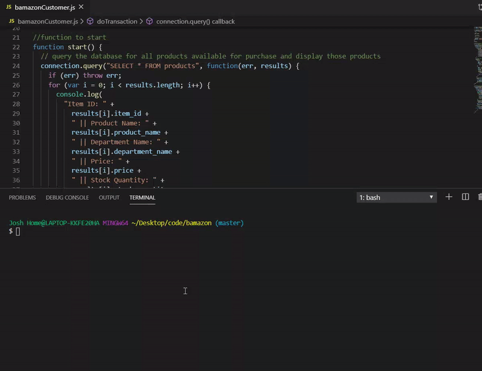
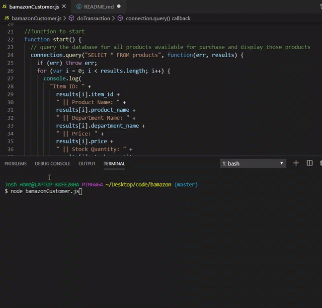
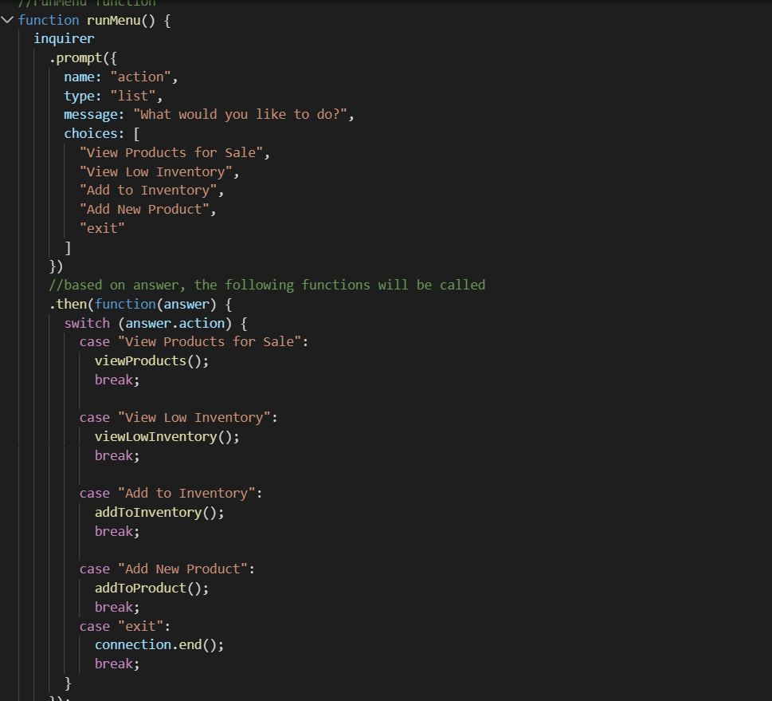
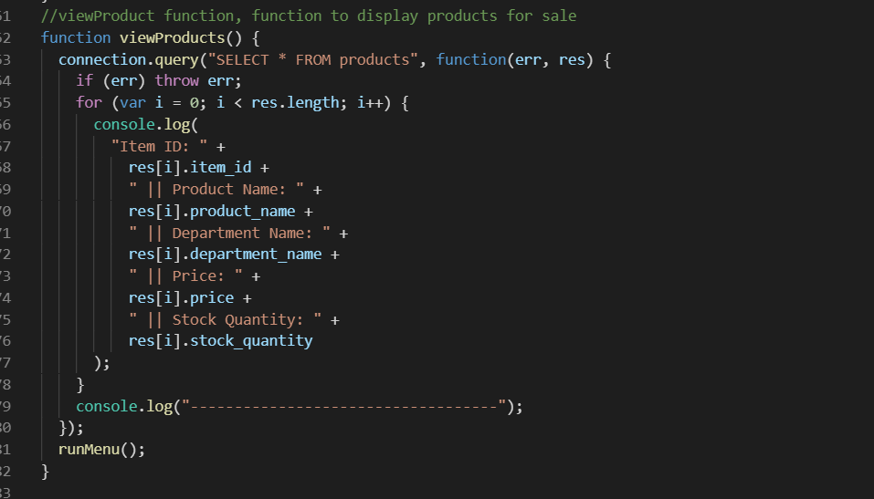
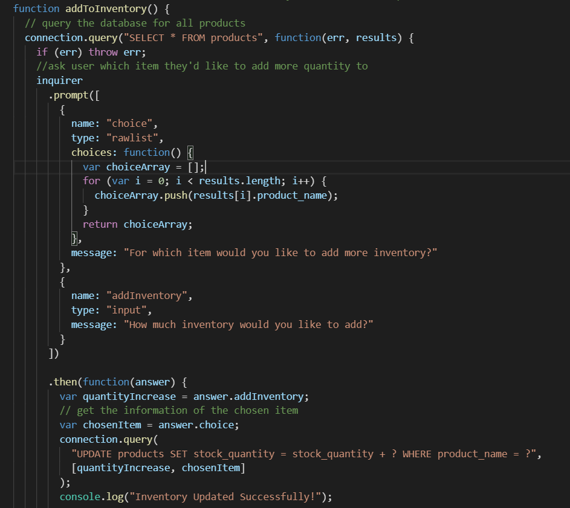
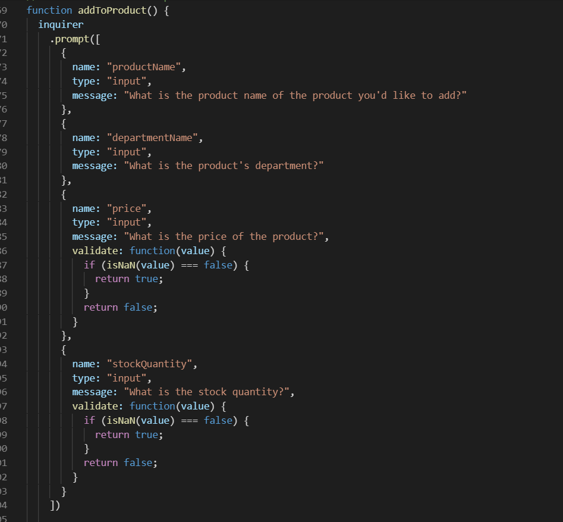
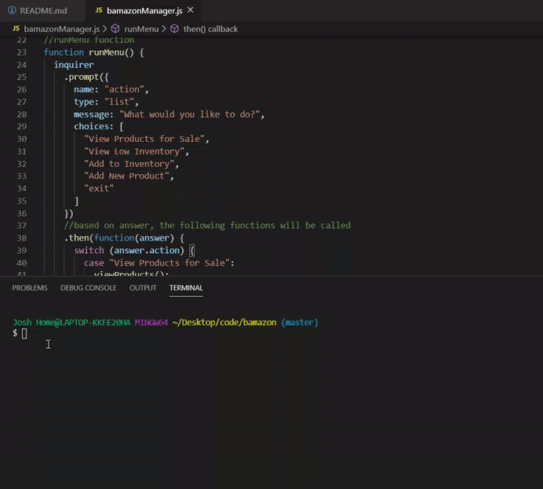
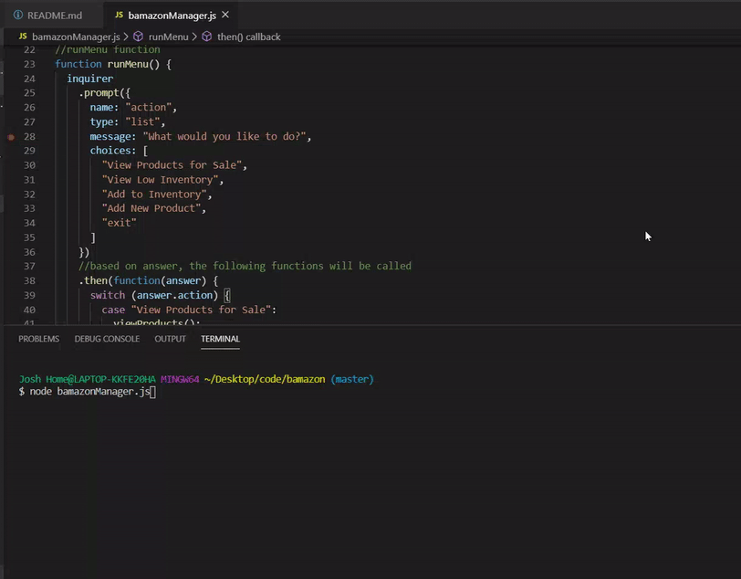
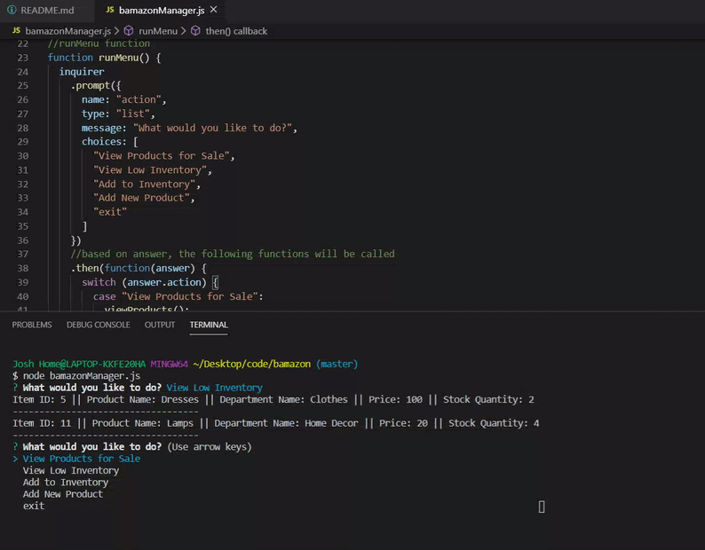
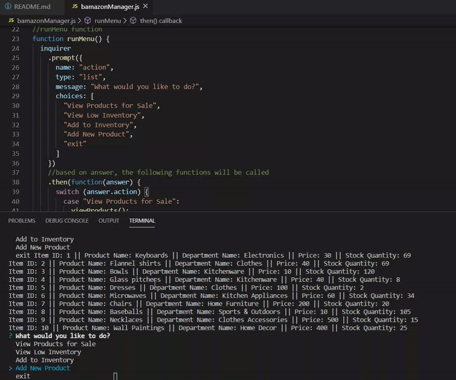

# bamazon

Bamazon is an application that will take in orders from customers and depletes the amount of products in stock, once a purchase is made. Additionally, there is a second part to the application that allows a manager to track and manage the product inventory.

**About the Application's database**

- Database is called bamazon and it consists of one table called 'Products'
- the Products table consists of the following columns:
  - item_id (unique id for each product)
  - product_name (name of product)
  - department_name (deparment of the product)
  - price (cost to customer)
  - stock_quantity (how much of the product is available)

**Challenge 1: bamazonCustomer.js**
Running the application does the following actions:

- Displays a list of all items available for sell
- Prompts customer to enter a product id of a product they would like to buy
- Then prompts customer to enter how many units of the product they would like to buy

Once the order is placed, the application then checks to see if there is enough of the product in stock for the purchase. If there's enough in stock, the customer is prompted so, and then they are given the total cost for their requested item and quanity. If there's not enough in stock, they are told that there is an Insufficient quantity.

The application consists of the following code:

- A start function that displays a list of the products and runs the application
  

- Prompts asking customer to enter the product id and quanity of units they would like to buy
  

- A doTransaction function that queries the database and verifies that there's enough in stock to make the purchase. If enough the total cost is shown.
  

- Within the doTransaction function, the database is also updated with the deducted quantity after the purcahse.
  

**Running the application and making a purchase**
Input in: node bamazonCustomer.js, enter item ID of product for purchase, and then enter quantity amount.

If not enough in stock, show 'Insufficient quantity' will be shown:

**Challenge 2: bamazonManager.js**
Running this application does the following actions:

- Lists the following Menu Options:
  - View Products for Sale
  - View Low Inventory
  - Add to Inventory
  - Add New Product

**Screenshots of the code:**

- runMenu: Function which displays a menu and uses inquirer to allow the user to pick which action they'd like to take
  

- viewProducts: Function which allows the user to view all products in the database
  

- viewLowIventory: Function which allows the user to view inventory that has less than 5 items in stock
  

- addToInventory: Function which allows the user to add to inventory
  

- addToProduct: Function which allows the user to add a product to the database
  

**GIFs of the applicaiton in action:**

- If a manager selects 'View Products for Sale', the application lists every item and their information.
  

- If a manager selects 'View Low Inventory, then it displays all items with an inventory count lower than five.
  

- If a manager selects 'Add to Inventory' the app displays a prompt that will allow the manager to add more of any item currently in the store.
  

- If a manager selects 'Add New Product', the application allows the manager to add a completely new product to the store.
  

**Technologies Used**

- mySql
- Inquirer
- node.js

**Link to the Application**
https://jlcoden.github.io/bamazon/

**Credits**
Developer and app creator: Josh Cosson
