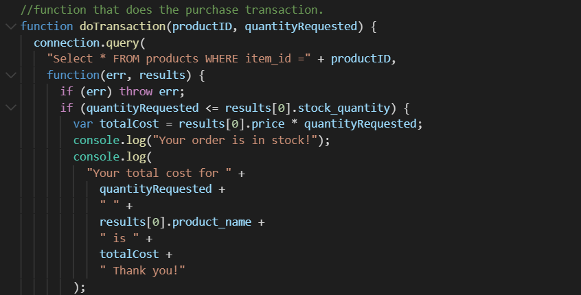

# bamazon

Bamazon is an application that will take in orders from customers and depletes the amount of products in stock, once a purchase is made. Additionally, there is a second part to the application that allows a manager to track and manage the product inventory.

**About the database**

- Database is called bamazon and it consists of one table called 'Products'
- the Products table consists of the following coluns:
  - item_id (unique id for each product)
  - product_name (name of product)
  - department_name (deparment of the product)
  - price (cost to customer)
  - stock_quantity (how much of the product is available)

**bamazonCustomer**
Running this application does the following actions:

    - Displays a list of all the items available for sell
    - Prompts customer to enter a product id of a product they would like to buy
    - Then prompts customer to enter how many units of the product they would like to buy

Once the order is placed, the application then checks to see if there is enough of the product in stock for the purchase. If there's enough in stock, the customer is prompted so, and then they are given the total cost for their requested item and quanity. If there's not enough in stock, they are told that there is an Insufficient quantity.

The application consists of the following code:

**Running the application and making a purchase**
Enter in: node bamazonCustomer.js, enter item ID of product for purchase, and then enter quantity amount.

If not enough in stock, show 'Insufficient quantity' will be shown:

**bamazonManager.js**
Running this application does the following actions:

- Lists the following Menu Options:

  - View Products for Sale
  - View Low Inventory
  - Add to Inventory
  - Add New Product

- If a manager selects 'View Products for Sale', the application lists every item and their information.
- If a manager selects 'View Low Inventory, then it displays all items with an inventory count lower than five.
- If a manager selects 'Add to Inventory' the app displays a prompt that will allow the manager to add more of any item currently in the store.
- If a manager selects 'Add New Product', the application allows the manager to add a completely new product to the store.
